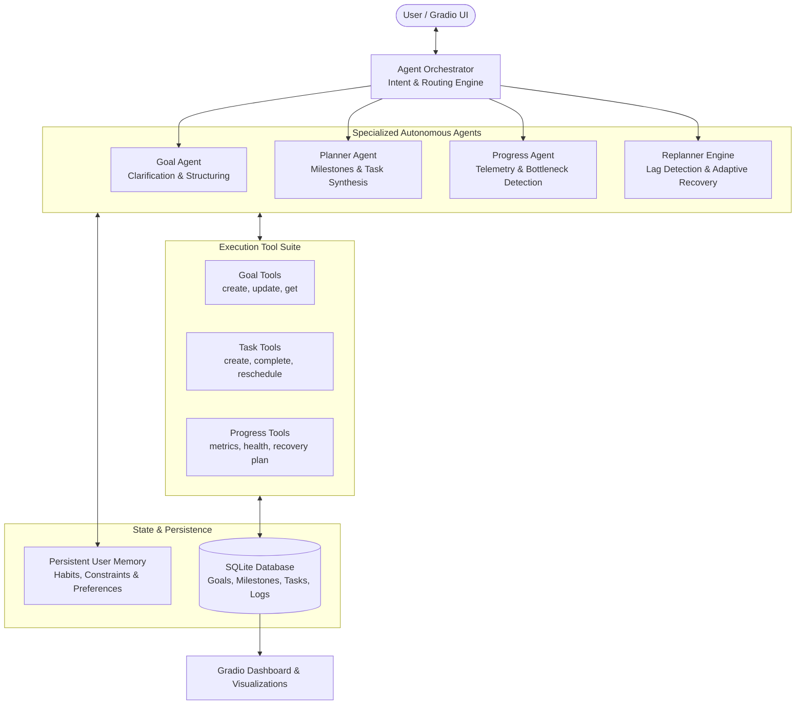

# ✦ GoalMate — Autonomous AI Personal Goal Coach

[](https://www.python.org/downloads/)
[](https://gradio.app/)
[](#agentic-architecture)
[](https://sqlite.org/)
[](LICENSE)

> **GoalMate** is an academic-grade, production-ready Autonomous AI Personal Goal Coach built for Agentic AI coursework and real-world personal productivity. Unlike simple prompt-response chatbots or static CRUD todo apps, GoalMate actively observes user constraints, clarifies ambiguous objectives, synthesizes multi-week milestones, executes database operations via deterministic tools, monitors progress telemetry, and autonomously adapts schedules when life gets in the way.

---

## 📑 Table of Contents
1. [Problem Statement & Objective](#problem-statement--objective)
2. [Core Agentic Architecture](#core-agentic-architecture)
3. [Key Capabilities & Features](#key-capabilities--features)
4. [System Architecture Diagram](#system-architecture-diagram)
5. [Tech Stack](#tech-stack)
6. [Project Directory Structure](#project-directory-structure)
7. [Installation & Setup](#installation--setup)
8. [Running the Application](#running-the-application)
9. [13-Step Viva Demonstration Walkthrough](#13-step-viva-demonstration-walkthrough)
10. [Viva Evaluation & Architectural Defense](#viva-evaluation--architectural-defense)
11. [Future Extensions](#future-extensions)

---

## 🎯 Problem Statement & Objective

Traditional productivity applications suffer from two extremes:
1. **Passive Todo Lists & Trackers**: Demand manual data entry, offer zero guidance on realistic pacing, and trigger guilt when tasks inevitably slip.
2. **Standard LLM Chatbots**: Provide generic motivational advice and static markdown plans, but have no persistent application state, cannot perform real database mutations, and cannot dynamically replan a user's schedule when constraints change.

**GoalMate bridges this gap by implementing a complete autonomous agentic loop:**
$$\text{Observe} \longrightarrow \text{Reason} \longrightarrow \text{Plan} \longrightarrow \text{Act} \longrightarrow \text{Observe} \longrightarrow \text{Adapt}$$

---

## 🧠 Core Agentic Architecture

GoalMate divides cognitive labor across specialized autonomous sub-agents coordinated by a central orchestrator:

| Component | Role & Responsibilities |
| :--- | :--- |
| **Agent Orchestrator** | Intent classification, context gathering (active goal, memory profile, pending tasks), and deterministic agent routing. |
| **Goal Agent** | Evaluates goal completeness, detects vague objectives, asks targeted clarifying questions (daily availability, timeframes), and structures goals. |
| **Planner Agent** | Converts structured goals into sequential milestones and actionable daily tasks with realistic durations and priorities. |
| **Progress Agent** | Evaluates completion percentages, streaks, consistency, and detects missed tasks or lagging trajectories. |
| **Replanner Engine** | Algorithmic replanner that redistributes accumulated backlogs smoothly across upcoming days respecting daily time constraints without cognitive cramming. |
| **Persistent Memory** | Retains non-sensitive user traits (e.g. night owl study habit, daily time limits, experience level) across sessions in SQLite. |
| **Deterministic Tool Suite** | Direct database mutation layer (`create_goal`, `create_task`, `complete_task`, `reschedule_task`, etc.) ensuring no hallucinated actions. |

---

## 📊 System Architecture Diagram



---

## 🛠️ Tech Stack

- **Core Logic**: Python 3.10+
- **UI Framework**: Gradio 6.0+ (Custom Dark SaaS Glassmorphism Theme)
- **Data Persistence**: SQLite 3 (Thread-safe, relational schema with foreign key cascades)
- **Visual Analytics**: Plotly (Interactive task status donuts & weekly productivity charts)
- **LLM Integrations**: Google GenAI SDK (`gemini-2.5-flash`), Groq (`llama-3.3-70b-versatile`), and an **Autonomous Heuristic Fallback Engine** ensuring 100% offline functionality.

---

## 📁 Project Directory Structure

```text
GoalMate/
├── app.py                      # Main Gradio application entry point
├── config.py                   # Configuration, environment loading, and model settings
├── requirements.txt            # Python dependencies
├── .env.example                # Template for optional API keys
├── .gitignore                  # Git exclusions
├── test_system.py              # Automated 13-step end-to-end verification test
├── README.md                   # System documentation & viva guide
│
├── database/                   # Relational Persistence Layer
│   ├── __init__.py
│   ├── schema.py               # SQLite schema (goals, milestones, tasks, logs, memory)
│   └── db.py                   # Connection manager & demo data seeder
│
├── memory/                     # Long-term Semantic & Habit Memory
│   ├── __init__.py
│   └── memory.py               # Extract, store, and retrieve user preferences
│
├── tools/                      # Deterministic Tools Suite (Real DB Mutations)
│   ├── __init__.py
│   ├── goal_tools.py           # create_goal, get_goals, update_goal, delete_goal
│   ├── task_tools.py           # create_task, complete_task, reschedule_task
│   └── progress_tools.py       # calculate_progress, analyze_health, generate_recovery_plan
│
├── agents/                     # Multi-Agent Reasoning Layer
│   ├── __init__.py
│   ├── llm_client.py           # Multi-provider gateway (Gemini / Groq / Fallback)
│   ├── orchestrator.py         # Supervisor router & intent classifier
│   ├── goal_agent.py           # Clarification detection & goal extractor
│   ├── planner_agent.py        # Curriculum & milestone task synthesizer
│   └── progress_agent.py       # Check-in, weekly review, and adaptive replanning
│
├── ui/                         # Presentation Layer
│   ├── __init__.py
│   ├── components.py           # KPI cards, goal cards, task board, Plotly charts
│   └── styles.css              # Custom SaaS glassmorphism CSS
│
└── data/
    └── goalmate.db             # Local SQLite database file
```

---

## ⚡ Installation & Setup

### 1. Clone the repository
```bash
git clone https://github.com/your-username/GoalMate.git
cd GoalMate
```

### 2. Create and activate virtual environment
```bash
# Windows
python -m venv venv
venv\Scripts\activate

# Linux / macOS
python3 -m venv venv
source venv/bin/activate
```

### 3. Install dependencies
```bash
pip install -r requirements.txt
```

### 4. (Optional) Configure Environment Variables
GoalMate is equipped with an **Autonomous Heuristic Fallback Engine**, meaning **it runs 100% locally out-of-the-box even without an API key**!
If you wish to use Google Gemini or Groq:
```bash
cp .env.example .env
```
Edit `.env`:
```ini
GEMINI_API_KEY=your_gemini_api_key_here
GROQ_API_KEY=your_groq_api_key_here
```

---

## 🚀 Running the Application

### Launch the Gradio Web Application:
```bash
python app.py
```
Open your browser and navigate to:
```
http://127.0.0.1:7860
```

### Run the Automated End-to-End Test Suite:
```bash
python test_system.py
```

---

## 🎬 13-Step Viva Demonstration Walkthrough

You can execute this exact 13-step demonstration live during your presentation or defense:

| Step | User Action | Agentic AI Response & System Behavior |
| :---: | :--- | :--- |
| **1** | `"I want to learn Python in two months."` | **Observe & Reason**: Agent detects the goal is missing a daily time constraint. |
| **2** | *(Agent response)* | **Clarification**: *"Great! 🎯 Before I build your plan, how much time can you realistically spend on this each day?"* |
| **3** | `"About 1 hour."` | **Observe & Store**: Agent extracts 60 mins/day, creates structured Goal record in SQLite. |
| **4** | *(Plan Synthesis)* | **Planner Agent**: Generates 6 sequenced milestones and 13 daily tasks. |
| **5** | *(Persistence)* | **Act**: Tasks are inserted into SQLite with due dates, priorities, and durations. |
| **6** | Click `[ ✅ Mark Selected Task Done ]` | **Act**: Task #1 marked complete in SQLite; completion timestamp recorded. |
| **7** | Dashboard updates | **Telemetry**: Overall progress moves to 7.7%, streak advances to 1 day. |
| **8** | `"I haven't studied for four days."` | **Observe**: Agent parses 4-day lag from conversation. |
| **9** | *(DB Inspection)* | **Reason**: Progress Agent queries SQLite to inspect pending/overdue tasks. |
| **10** | *(Lag Detection)* | **Reason**: Identifies 4 missed days and accumulated backlog. |
| **11** | *(Recovery Planning)* | **Plan**: Generates recovery schedule spreading tasks across next week to prevent cramming. |
| **12** | *(DB Adaptation)* | **Act**: Updates task due dates in SQLite directly (`status = 'rescheduled'`). |
| **13** | Dashboard refresh | **Feedback**: Chat explains exact shifted dates; dashboard reflects updated timeline. |

---

## 🎓 Viva Evaluation & Architectural Defense

When presenting this project for an **Agentic AI course**, use these answers during your viva:

### Q1: How does GoalMate differ from a standard LLM chatbot with system prompts?
> *"A standard chatbot only generates text responses; it lacks persistent state, environment interaction, and closed-loop feedback. GoalMate implements the complete agentic cycle (**Observe → Reason → Plan → Act → Observe → Adapt**). It interacts with an external environment (SQLite), invokes deterministic tools, persists user constraints into long-term memory, and performs real state mutations. If the agent states that a task was rescheduled, a real database record was updated."*

### Q2: How is Adaptive Replanning implemented to avoid cognitive overload?
> *"When a user falls behind (e.g. misses 4 days), naive systems either do nothing or cram 4 days of work into today. GoalMate's Replanner Engine enforces a daily time ceiling ($C_{\text{daily}} = 60\text{ min}$). It sorts overdue tasks by priority (High $\rightarrow$ Medium $\rightarrow$ Low), places at most one or two tasks per day starting today, and cascades future tasks forward. This prevents cognitive exhaustion and promotes sustainable habit formation."*

### Q3: How is resilience guaranteed during API failures or quota exhaustion?
> *"GoalMate implements a resilient multi-tier LLM architecture. It tries Google Gemini 2.5 Flash, then Groq, and if no API key is provided or if network fails, it falls back to a deterministic Autonomous Heuristic Engine. This ensures the application never crashes and can be reliably evaluated in offline academic environments."*

---

## 🔮 Future Extensions
- **Multi-Modal Goal Tracking**: Support uploading photo proof of completed workouts or study notes with Gemini Vision verification.
- **Calendar Synchronization**: Export tasks to Google Calendar or iCal via standard `.ics` feeds.
- **Biometric Integration**: Connect with Apple Health / Google Fit to adapt fitness plans based on recovery and sleep scores.

---

## 📄 License
This project is licensed under the MIT License — see the [LICENSE](LICENSE) file for details.
