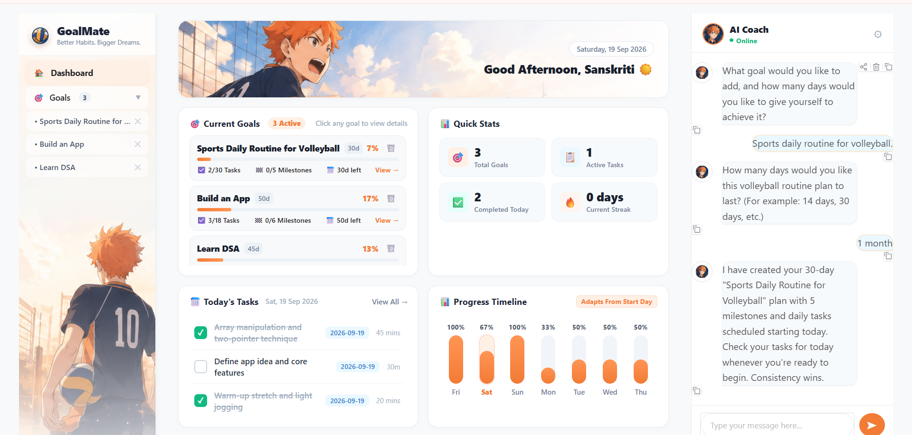
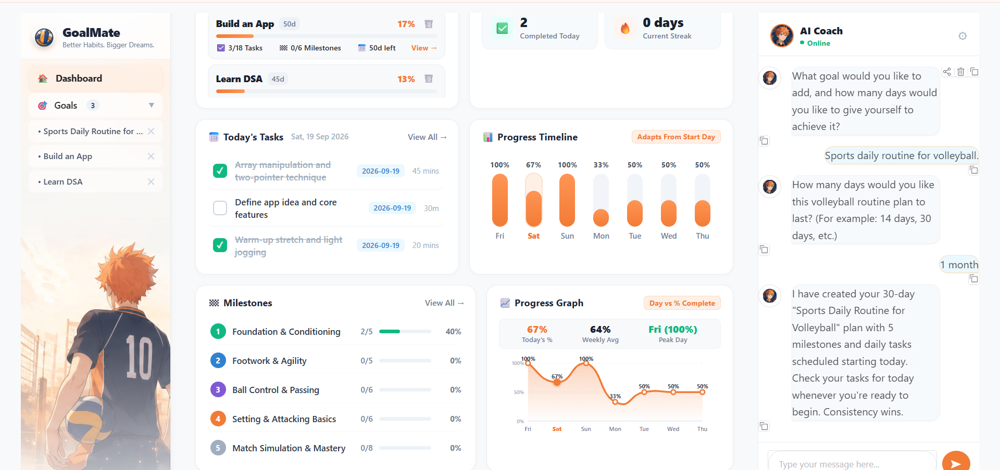
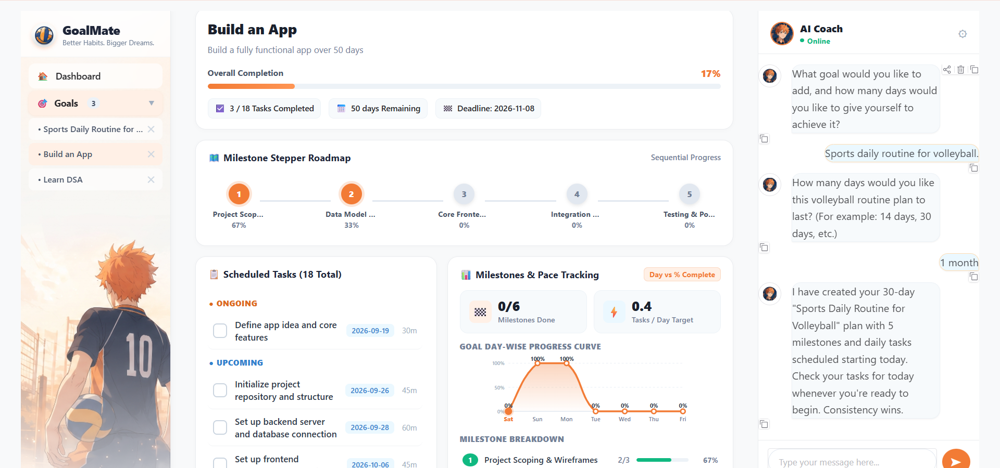

# GoalMate

  

  <strong>Turn a goal into a plan. Turn the plan into action. Keep adapting until you get there.</strong>

  
  
  
  
  
  

  <em>An agentic personal goal-tracking system built around planning, execution, memory, progress analysis and adaptive replanning.</em>

---

## The idea

Most goal trackers make <strong>you</strong> do the planning.

You enter a goal, create milestones, write tasks, assign dates, update progress and figure out what to do when you fall behind.

<strong>GoalMate flips that workflow.</strong>

Tell it:

> <strong>"I want to learn Angular in 30 days."</strong>

The agent can turn that one sentence into a structured execution plan — then continue working with the plan as your situation changes.

~~~text
                 "I want to learn Angular in 30 days"
                                │
                                ▼
                         ┌─────────────┐
                         │  AI Agent   │
                         └──────┬──────┘
                                │
                 ┌──────────────┼──────────────┐
                 ▼              ▼              ▼
             Milestones       Tasks        Schedule
                 │              │              │
                 └──────────────┼──────────────┘
                                ▼
                         Persistent State
                                │
                                ▼
                       Progress + Analytics
                                │
                                ▼
                       Adaptive Replanning
~~~

The important part is that the LLM isn't treated as the source of truth.

<strong>The database is.</strong>

The agent reasons over the user's request, calls real tools, changes persistent state, reads the result back and then responds.

---

# ✦ What makes GoalMate different?

<table>
<tr>
<td width="50%" valign="top">

### 🧠 Agentic, not just conversational

The AI can actually perform application actions through tool/function calling.

It can:

- create goals
- generate plans
- retrieve progress
- fetch today's tasks
- complete tasks
- analyze missed work
- replan schedules
- inspect goal details
- delete goals after confirmation
- search learning resources

</td>
<td width="50%" valign="top">

### 🔄 Plans that can change

A 30-day plan isn't useful if missing two days breaks the entire schedule.

GoalMate can reason about the current state and <strong>recalibrate pending work</strong> when the user's timeline or availability changes.

</td>
</tr>
<tr>
<td width="50%" valign="top">

### 🧩 Persistent memory

GoalMate can remember useful preferences and constraints such as:

- preferred study time
- available daily time
- experience level
- other explicit planning preferences

These are stored persistently rather than disappearing when the chat ends.

</td>
<td width="50%" valign="top">

### 📊 Real progress, not generated numbers

Progress metrics are calculated from actual stored goals, milestones, tasks and activity logs.

The agent is explicitly instructed not to invent progress data.

</td>
</tr>
</table>

---

# 🖥️ Product Tour

## Dashboard

  

The main dashboard brings the important pieces together:

<strong>Active goals · today's tasks · milestones · progress · recent activity · AI Coach</strong>

---

## AI Coach

  

The AI Coach is connected to the application's agent layer rather than being a decorative chatbot.

A request such as:

~~~text
"I only have 30 minutes today."
~~~

can be interpreted against the user's actual pending tasks and planning context.

Likewise:

~~~text
"I couldn't finish yesterday's tasks."
~~~

can trigger missed-task analysis and adaptive replanning.

---

## Goal & Milestone View

  

Each goal maintains its own execution structure:

~~~text
Goal
 ├── Milestone 01
 │    ├── Task
 │    ├── Task
 │    └── Task
 │
 ├── Milestone 02
 │    ├── Task
 │    └── Task
 │
 └── Milestone 03
      ├── Task
      └── Task
~~~

Multiple goal tracks can exist simultaneously.

---

## Progress Analytics

  

The Progress view turns task history into usable signals such as:

- completion percentage
- completed vs pending work
- streaks
- weekly consistency
- task volume
- goal health / trajectory
- recent activity

---

## Authentication

  

GoalMate includes an authentication layer using:

<strong>bcrypt password hashing + JWT access tokens + user-scoped goal data</strong>

The backend exposes registration, login and authenticated API routes, allowing the application to move beyond a single shared goal space.

---

# ⚙️ How the Agent Works

GoalMate follows an agentic execution loop rather than simply sending every message to an LLM and displaying the response.

~~~text
┌──────────────────┐
│   User Message   │
└────────┬─────────┘
         ▼
┌──────────────────┐
│ Intent / Context │
│     Analysis     │
└────────┬─────────┘
         ▼
┌──────────────────┐
│   Gemini LLM     │
│ Reason + Decide  │
└────────┬─────────┘
         │
         │ function call
         ▼
┌──────────────────┐
│    Tool Router   │
└────────┬─────────┘
         ▼
┌──────────────────┐
│ Backend Services │
│ + Database State │
└────────┬─────────┘
         │
         │ tool result
         ▼
┌──────────────────┐
│   Gemini LLM     │
│ Interpret Result │
└────────┬─────────┘
         ▼
┌──────────────────┐
│   User Response  │
└──────────────────┘
~~~

### Example

For:

> <strong>"Make my Angular plan 20 days instead of 30."</strong>

the system can:

1. identify the replanning intent
2. determine the relevant goal
3. calculate the new schedule
4. reschedule pending work
5. preserve completed work
6. return the updated plan

That's the difference between an <strong>AI chat interface</strong> and an <strong>AI agent operating on application state</strong>.

---

# 🧰 Agent Toolset

The current agent exposes tools for real database-backed actions:

| Tool | What it does |
|---|---|
| <code>create_goal_with_plan</code> | Creates a goal, milestones and scheduled tasks |
| <code>get_user_progress_summary</code> | Reads current goals and progress |
| <code>get_today_tasks_list</code> | Retrieves today's tasks |
| <code>complete_task_by_id</code> | Completes / uncompletes a task |
| <code>replan_goal_duration</code> | Rebuilds the pending schedule around a new duration |
| <code>analyze_missed_tasks</code> | Finds overdue / missed work |
| <code>get_goal_details</code> | Reads a goal with its execution structure |
| <code>delete_goal_by_id</code> | Deletes a goal after confirmation |
| <code>search_learning_resources</code> | Finds external learning resources through web search |

---

# 🧠 Persistent Memory

GoalMate also includes a lightweight memory layer.

When users explicitly provide useful constraints, the system can persist them and use them as context later.

For example:

~~~text
User:
I usually study better at night and only have 45 minutes a day.

                ↓

Memory Layer

preferred_study_time → night
daily_available_time → 45 minutes/day
~~~

This allows planning to become more personalized over time.

---

# 🏗️ Architecture

  

The architecture diagram above shows how the GoalMate interface, backend, AI agent layer, domain services and persistent database work together.

---

# 🛠️ Technology Stack

<table>
<tr>
<th>Layer</th>
<th>Technology</th>
</tr>
<tr>
<td>Language</td>
<td>Python</td>
</tr>
<tr>
<td>UI</td>
<td>Gradio + HTML + CSS + JavaScript</td>
</tr>
<tr>
<td>Backend</td>
<td>FastAPI + Uvicorn</td>
</tr>
<tr>
<td>AI</td>
<td>Google Gemini</td>
</tr>
<tr>
<td>Agent Pattern</td>
<td>LLM reasoning + function/tool calling + specialized agents</td>
</tr>
<tr>
<td>Database</td>
<td>SQLite</td>
</tr>
<tr>
<td>ORM</td>
<td>SQLAlchemy</td>
</tr>
<tr>
<td>Authentication</td>
<td>JWT + bcrypt</td>
</tr>
<tr>
<td>Memory</td>
<td>SQLite-backed preference memory</td>
</tr>
<tr>
<td>Web Research</td>
<td>Tavily</td>
</tr>
<tr>
<td>Visualization</td>
<td>Plotly + custom HTML/SVG components</td>
</tr>
</table>

---

# 📁 Project Structure

~~~text
AI-Agent-for-Personal-Goal-Tracking/
│
├── agent/                 # Core GoalMate agent + tools
│   ├── agent.py
│   ├── llm.py
│   ├── prompts.py
│   ├── replanner.py
│   └── tools.py
│
├── agents/                # Specialized agent orchestration
│   ├── goal_agent.py
│   ├── planner_agent.py
│   ├── progress_agent.py
│   ├── replanner.py
│   ├── orchestrator.py
│   └── llm_client.py
│
├── backend/               # FastAPI backend + auth + services
│   ├── app.py
│   ├── auth.py
│   ├── models.py
│   ├── routes.py
│   └── services.py
│
├── database/              # Database setup, models and CRUD
│
├── memory/                # Persistent user preference memory
│
├── services/              # Goal, task, progress and research services
│
├── tools/                 # Domain-specific agent tools
│
├── ui/                    # Gradio UI and dashboard components
│
├── frontend/              # Frontend assets and static resources
│
├── assets/                # Visual assets / application artwork
│
├── screenshots/           # Application screenshots
│
├── app.py                 # Application entry point
├── config.py              # Environment and model configuration
├── requirements.txt
│
├── test_acceptance.py
├── test_full_system.py
├── test_hackathon_flow.py
├── test_module3.py
└── test_system.py
~~~

---

# 🚀 Run Locally

### 1. Clone

~~~bash
git clone https://github.com/s4nskrut1/AI-Agent-for-Personal-Goal-Tracking.git
cd AI-Agent-for-Personal-Goal-Tracking
~~~

### 2. Create a virtual environment

<strong>Windows</strong>

~~~bash
python -m venv .venv
.venv\Scripts\activate
~~~

<strong>macOS / Linux</strong>

~~~bash
python3 -m venv .venv
source .venv/bin/activate
~~~

### 3. Install dependencies

~~~bash
pip install -r requirements.txt
~~~

### 4. Configure environment variables

Create a local <code>.env</code> file using <code>.env.example</code>.

At minimum:

~~~env
GEMINI_API_KEY=your_gemini_api_key
JWT_SECRET_KEY=your_secret_key
~~~

Optional providers / integrations supported by the codebase can be configured through their respective environment variables.

<strong>Never commit real API keys or secrets.</strong>

### 5. Start GoalMate

~~~bash
python app.py
~~~

Then open:

~~~text
http://127.0.0.1:7860
~~~

---

# 🧪 Verification

GoalMate includes dedicated system and acceptance tests covering the core workflow.

The tested areas include:

- application startup
- goal creation
- milestone and task generation
- today's task retrieval
- task completion
- progress calculation
- missed-task handling
- adaptive replanning
- multiple concurrent goals

Run the acceptance suite with:

~~~bash
python test_acceptance.py
~~~

Additional system-level tests are included in the repository for deeper verification.

---

# 🔐 Security Notes

- API keys are loaded through environment variables.
- Passwords are stored as bcrypt hashes.
- Authentication uses signed JWT access tokens.
- Goal and task APIs are scoped to the authenticated user.
- Secrets should remain in <code>.env</code>, which is excluded from version control.

For production deployment, the default development configuration should be hardened further with a strong externally managed secret, HTTPS, production database configuration and appropriate deployment controls.

---

# 🔭 What's next?

GoalMate is intentionally structured so the local SQLite implementation can evolve into a production-grade system.

Potential next steps:

- PostgreSQL + async database access
- richer calendar integration
- notifications and reminders
- stronger multi-user session handling
- PWA / mobile experience
- deeper web research and resource recommendations
- production deployment with Docker + reverse proxy
- richer long-term behavioural analytics

---

# 🎓 Project

<strong>AI Agent for Personal Goal Tracking</strong>

<strong>Application:</strong> GoalMate  
<strong>Domain:</strong> AI Agents · Productivity · Personal Planning · Goal Tracking  
<strong>Institution:</strong> Symbiosis Institute of Technology  
<strong>Academic Year:</strong> 2026–27

---

## Author

  

  <strong>Sanskruti Gorle</strong> 
  B.Tech Computer Science Engineering 
  Symbiosis Institute of Technology

  

---

  GoalMate — because having a goal is easy. Showing up for it is the real project.

